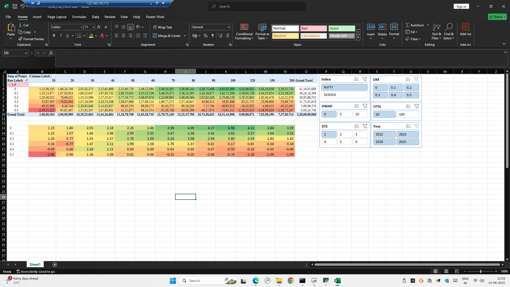

This is a Simple B120 Statergy Where As a Seller we sell the options and if the sl hits we buy back option....
For example:-

## 🚀 Strategy Logic

- Entry Time: **09:16 AM**
- Instrument: **ATM CE/PE**
- Side: **SELL**
- Stop Loss: **40%*
-vwap: 0%, 5%, 10%

Note:- I added vwap,
vwap:- Function Summary: find_vwap(t_df)
This function calculates the cumulative VWAP (Volume Weighted Average Price) for an ATM straddle combining both CE (Call) and PE (Put) option legs.
Input: t_df, a DataFrame with columns:
date_time, CE_price, PE_price, CE_volume, PE_volume
Process:
Computes straddle price as the sum of CE and PE prices.
Calculates price × volume (pv) for each leg and total.
Computes cumulative sum of price-volume and total volume.
Derives cumulative straddle VWAP using the formula:
VWAP= ∑(price×volume)/∑(volume)

after finding all day vwap we enter in the market when the vwap price is greater than straddle price
this indicates the market is going towards stable and straddle leads to 0 at the end of the market.

## 📊 Features

- PnL summary with trade logs
- Strategy visualization (line chart)
- Customizable entry/SL logic
- Handles real-time data in future version

## 🗃️ Files

| File | Description |
|------|-------------|
| `strategy_backtest.py` | Main backtesting logic |
| `data/sample_data.pkl` | Sample OHLC+OI data |
| `sample_output/backtest_results.png` | Visual output of performance |
| `notebooks/strategy_walkthrough.ipynb` | Jupyter breakdown of strategy |

## 📦 Tech Stack

- Python, Pandas
- Pickle, datetime, numpy

## 📌 Sample Output

---

## 📬 Contact

Harshit Chawla  
[LinkedIn](https://www.linkedin.com/in/harsh56/) • [Email](mailto:hrshtchwl@gmail.com)